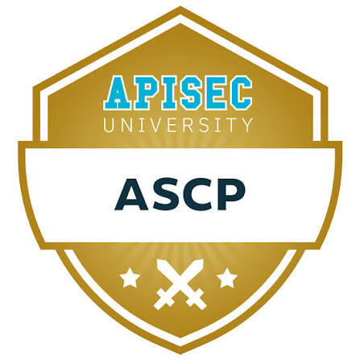
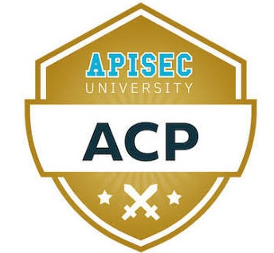
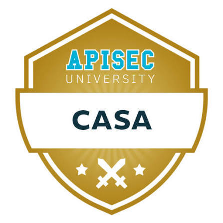
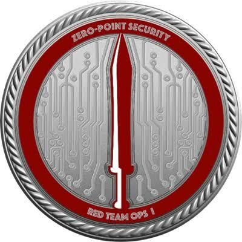
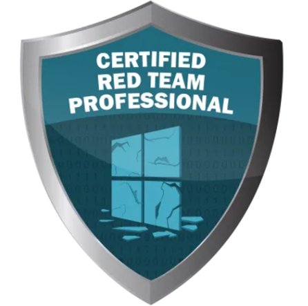
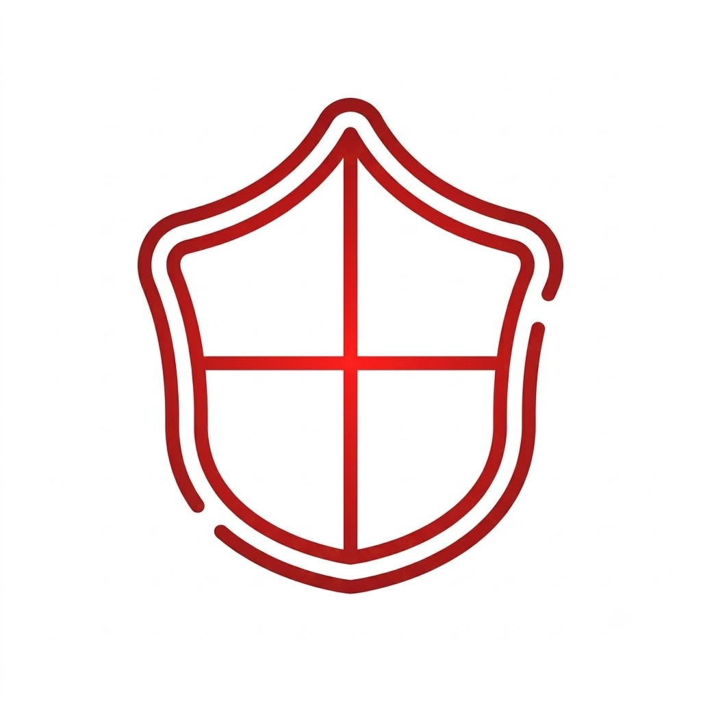
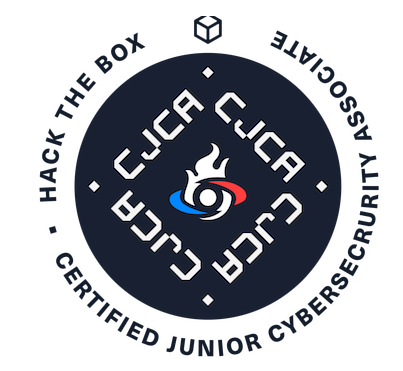
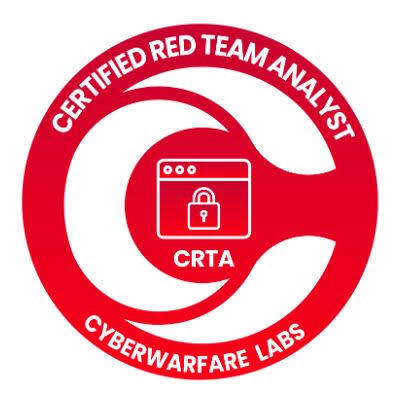
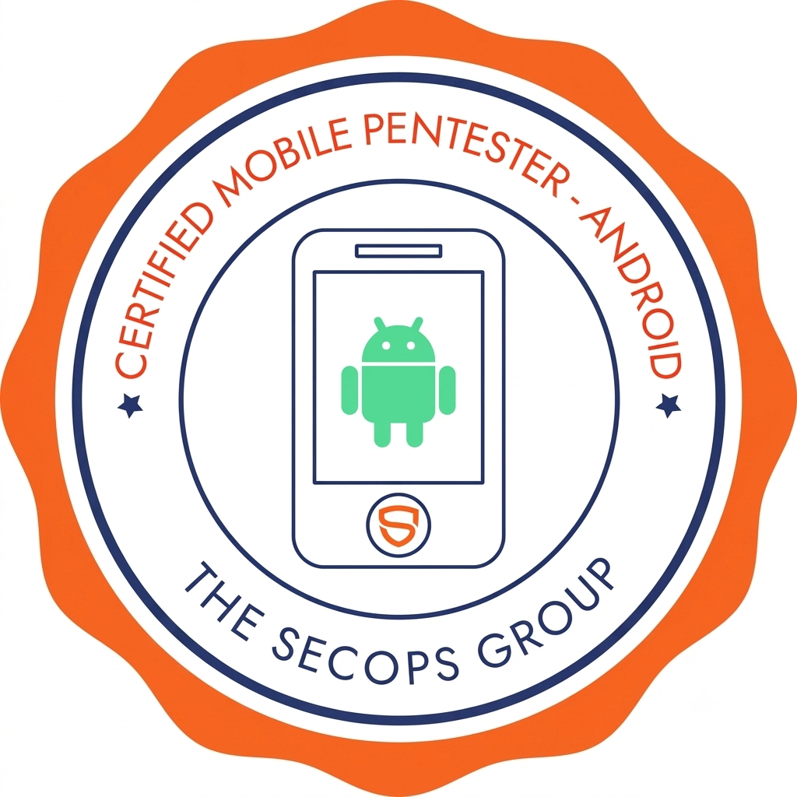

---

## 🧑‍💻 About Me

I'm a **Red Team Consultant & Penetration Tester** at **Hacktilizer Cybersecurity Consulting**, based between **Bangkok** and **Yangon**. My work covers full-spectrum offensive security — Web/API, Mobile (Android/iOS), Active Directory attacks, and Red Team operations — for clients across **Finance, Food & Beverage, Delivery Services, and Education** sectors.

I've received bug bounty recognition from **~48 organizations**, including Google VRP, Binance, NASA, IBM, and the Singapore Government.

- 🔭 Currently working on client red team engagements & AD attack chains
- 🎯 Focused on Active Directory, Kerberos attacks, and C2 tradecraft (Cobalt Strike)
- 🛡️ Growing into Blue Team / detection engineering (Elastic, KQL, Sysmon, MITRE ATT&CK)
- 📝 Sharing course notes & write-ups in this repo
- 🌐 Full profile & resume: **[phyowathonewin.pro](https://phyowathonewin.pro/)**

---

## 🏆 Certifications

<table>
  <tr>
    <td align="center" width="140">
      <a href="https://www.credly.com/badges/e7074305-ae71-4821-ab7e-b7ac26af5320/public_url">
         
        <b>ASCP</b>
      </a>
    </td>
    <td align="center" width="140">
      <a href="https://www.credly.com/badges/670e0feb-3ab6-4694-9e6d-5e529bcc37d4/public_url">
         
        <b>ACP</b>
      </a>
    </td>
    <td align="center" width="140">
      <a href="https://www.credly.com/badges/9363587d-f650-4656-9368-587868c862fe/public_url">
         
        <b>CASA</b>
      </a>
    </td>
    <td align="center" width="140">
       
      <b>CRTO</b>
    </td>
    <td align="center" width="140">
      <a href="https://www.credential.net/0f9baf73-08dc-4174-bd15-9e6c766a0910#acc.v1OlLJWy">
         
        <b>CRTP</b>
      </a>
    </td>
  </tr>
  <tr>
    <td align="center" width="140">
      <a href="https://www.credential.net/ae1e339e-2599-42c3-81c4-0ae4f75a7720#acc.b3G7HcwN">
         
        <b>CRTSv2</b>
      </a>
    </td>
    <td align="center" width="140">
       
      <b>CJCA</b>
    </td>
    <td align="center" width="140">
      <a href="https://www.credential.net/751f1d5c-60ac-4328-92e5-19729a135cfb#acc.54tIHBqn">
         
        <b>CRTA</b>
      </a>
    </td>
    <td align="center" width="140">
       
      <b>MCRTA</b>
    </td>
    <td align="center" width="140">
       
      <b>CMPen</b>
    </td>
  </tr>
</table>

---

## 🛠️ Core Skills

**Offensive Security**
`Web / API Pentesting` `Mobile (Android/iOS) Pentesting` `Active Directory Attacks` `Kerberos (RBCD, Constrained Delegation, Domain Trusts)` `AD CS (ESC1/ESC4/ESC8)` `Cobalt Strike & Malleable C2` `Red Team Operations`

**Defensive / Blue Team**
`Elastic (ELK/Kibana)` `KQL` `Sysmon` `MITRE ATT&CK Mapping` `Alert Triage`

**Other**
`Bug Bounty Hunting` `Vulnerability Research` `Security Reporting (SysReptor)` `Python / Bash Scripting`

---

## 🎓 Education

- **B.Sc (Hons) Cyber Security and Networking** – University of Lancashire
- **HND Computer Science** – M.S.T Institute

---

## 💼 Experience

- **Red Team Consultant / Penetration Tester** — Hacktilizer Cybersecurity Consulting
- **Cyber Security Specialist** — AYA Bank
- **Security Analyst** — ONOW Myanmar
- **Lecturer / Pentester** — M.S.T University

---

## 📫 Get In Touch

---

🇲🇲 Made with care in Bangkok & Yangon

